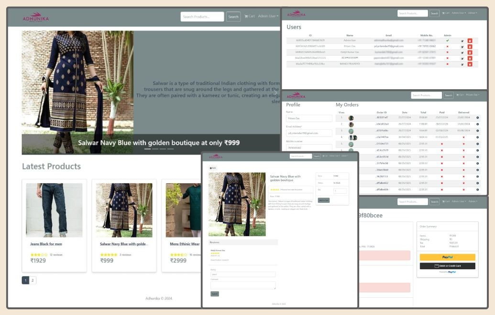

# Adhunika-Ecom-platform
An Ecommerce platform for Adhunika Shop in Kalna



<h3>You can also visit the live website from the link below and play with the beta version</h3>
<h2>👉 <a href="https://adhunika-ecom-platform.onrender.com/" target="_blank">Adhunika E-Com</a></h2>

## Features

- Full featured shopping cart
- Product reviews and ratings
- Top products carousel
- Product pagination
- Product search feature
- User profile with orders
- Admin product management
- Admin user management
- Admin Order details page
- Mark orders as delivered option
- Checkout process (shipping, payment method, etc)
- PayPal / credit card integration
- Cash On Delivery to place an order without paying
- Database seeder (products & users)

### Env Variables

Rename the `.env.example` file to `.env` and add the following

```
NODE_ENV = development
PORT = 5000
MONGO_URI = your mongodb uri
JWT_SECRET = your jwt secret
PAYPAL_CLIENT_ID = your paypal client id
```

### Install Dependencies (frontend & backend)

```
npm install
cd frontend
npm install
```

### Run

```
# Run frontend (:3000) & backend (:5000)
npm run dev

# Run backend only
npm run server
```

## Build & Deploy

```
# Create frontend prod build
cd frontend
npm run build
```

### Seed Database

You can use the following commands to seed the database with some sample users and products as well as destroy all data

```
# Import data
npm run data:import

# Destroy data
npm run data:destroy
```

<h3>For any further information feel free to contact me : <a href="mailto:pd.pritamdas19@gmail.com">PD.PritamDas19@gmail.com</a>